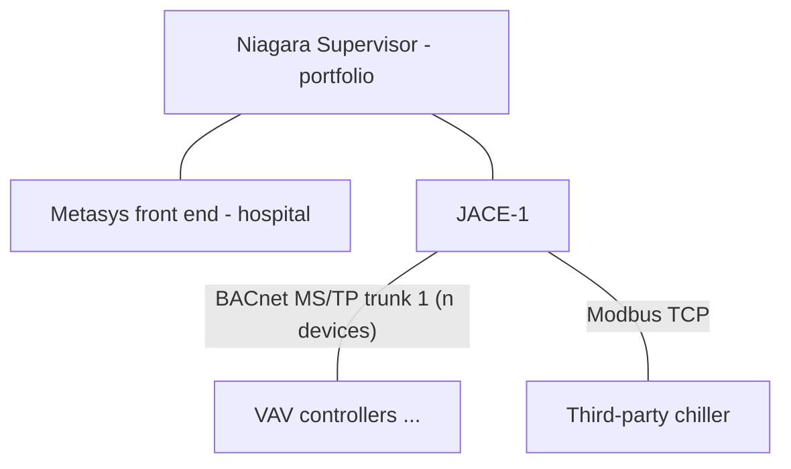

# BAS Network Riser — <P-XX> <Project Title>

## Riser Diagram

## Trunk Schedule

| Trunk | Protocol | Supervisor/parent | Devices (count) | Notes |
|---|---|---|---|---|
| <T-1> | <BACnet MS/TP> | <JACE-3> | <list, with count> | <device limit rationale> |

## Integration Points

| System | Protocol | Path into BAS | Points mapped |
|---|---|---|---|

## Design Rationale

- <Why trunks are segmented the way they are (device counts, life-safety
  separation, failure domains).>
- <IP segmentation assumptions, per docs/architecture.md zones.>

## Safety Note

Synthetic training artifact. Not a real network design.
