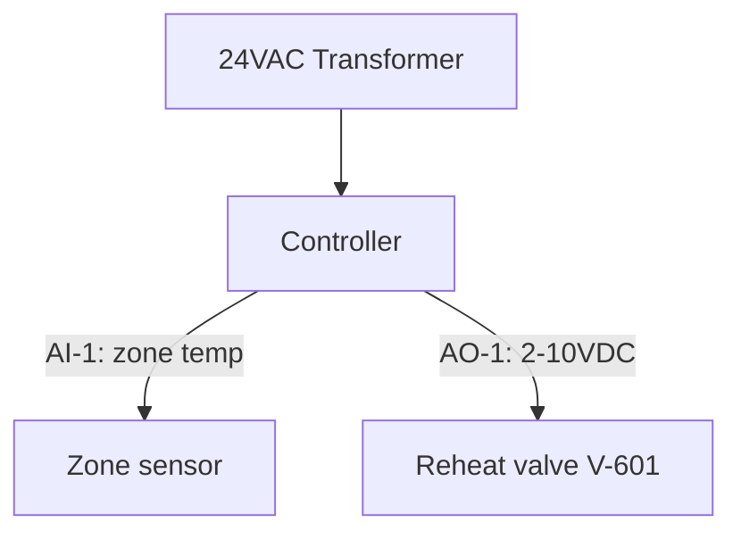

# DDC Panel Layout — <panel tag, e.g. DDC-PH-1>

## Enclosure Summary

- Location: <where it hangs>
- Enclosure: <e.g. NEMA 1, 24x24x8>
- Power: <e.g. 120 VAC circuit, 24 VAC transformer VA size>
- Controllers housed: <IDs>

## Parts Layout

| Position | Item |
|---|---|
| Backplate top-left | <24VAC transformer, 96VA> |

## Termination Schedule

| Terminal | Signal | Field device | Point name |
|---|---|---|---|
| TB1-1/2 | 24 VAC out | <...> | — |
| AI-1 | 10k thermistor | <zone sensor, rm 601> | VAV601_TEMP |

## Block Diagram

## Safety Note

Synthetic training artifact. Not a wiring or construction document.
