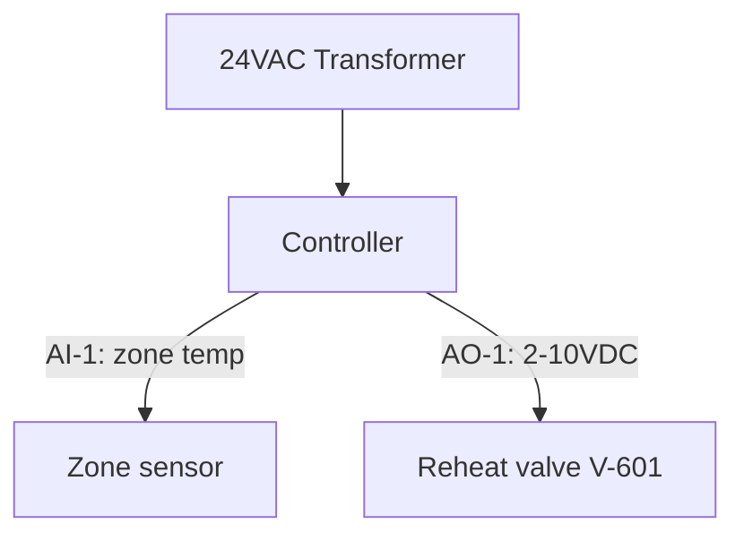
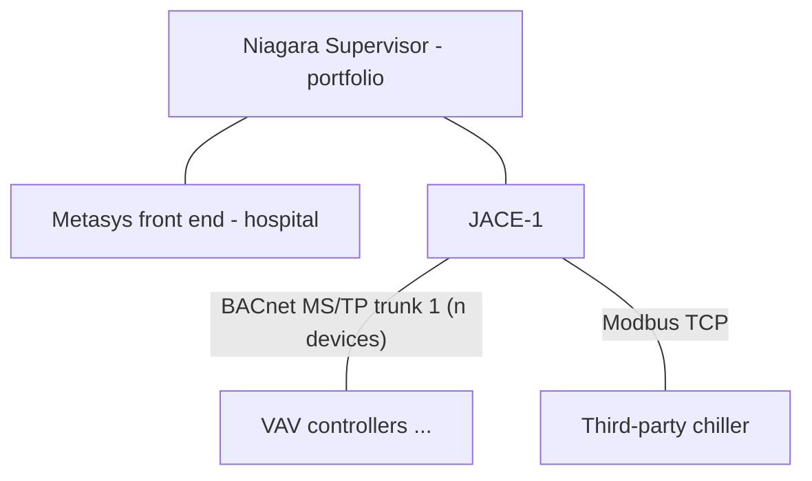

# DESIGN/ Design-Assist Track Implementation Plan

> **For agentic workers:** REQUIRED SUB-SKILL: Use superpowers:subagent-driven-development (recommended) or superpowers:executing-plans to implement this plan task-by-task. Steps use checkbox (`- [ ]`) syntax for tracking.

**Goal:** Add a design-engineer practice track to the slot-3 BAS lab: project briefs, site surveys against planted discrepancies, engineering-package deliverables, and AI-as-EOR submittal review — per the approved spec at `docs/superpowers/specs/2026-07-16-design-assist-track-design.md`.

**Architecture:** Pure content + one stdlib Python validator. A `DESIGN/` directory mirrors `BREAK/`'s anatomy (rulebook, sealed answers, running log). No changes to the live system (`simulator/`, `frontend/`, `open-source-stack/`). Machine-readable deliverables mirror `data/input/` record schemas exactly so Approach B (merge into the live lab) bolts on later.

**Tech Stack:** Markdown, JSON, Mermaid, Python 3.11+ standard library only.

## Global Constraints

- **NEVER run git commands.** No add, commit, status, stash — nothing. J owns git entirely and commits manually. (This overrides any commit steps a process skill would normally require.)
- All content is synthetic. Never add real facility data, PHI, credentials, IPs, vendor exports, or real design sequences (`safety/data-boundary.md` applies).
- Python: 3.11+, standard library only. No new dependencies anywhere.
- Working root for all paths below: `GP-SECLAB/target-application/slot-3/` (the slot-3 repo root — the directory containing `BREAK/`).
- Do not modify: `simulator/`, `frontend/`, `open-source-stack/`, `data/`, `sequences/`, `BUILD/`, `BREAK/`, `evidence/`, `safety/`.
- Record schemas are copied from live inventories and are exact:
  - equipment record: `id, type, serves, vendor, controller, purdue_level(int), facility` — no other keys.
  - point record: `point, equipment, type, units, normal_min(num), normal_max(num), writable(bool), critical(bool), trend_interval_sec(int), facility` — no other keys. `type` ∈ {AI, AO, AV, BI, BO, BV}. Live `units` observed: `%`, `%RH`, `F`, `bool`, `in.w.c.`, `psi`, `psid` (validator treats units as free non-empty string).
  - alarm record: `point, condition, priority, message` — no other keys. `condition` ∈ {outside_normal}. `priority` ∈ {critical, high, medium, low}.
  - facility ∈ {hospital, office} (read live from `data/input/equipment.json` `facilities[].id`, never hardcoded in the validator).

---

### Task 1: Submittal validator with self-test

**Files:**
- Create: `scripts/validate-submittal.py`

**Interfaces:**
- Produces: CLI `python3 scripts/validate-submittal.py <submittal-dir>` → exit 0 (clean) / exit 1 (findings printed, one per line, prefixed `ERROR:`). `python3 scripts/validate-submittal.py --self-test` → runs embedded fixtures, exit 0/1.
- Consumed by: DESIGN.md review step zero (Task 3), J's pre-submit QA, and (future, Approach B) the merge pre-check.

- [ ] **Step 1: Write the failing invocation**

Run: `python3 scripts/validate-submittal.py --self-test`
Expected: FAIL — `python3: can't open file ... No such file or directory`

- [ ] **Step 2: Write the validator**

Create `scripts/validate-submittal.py` with exactly this content:

```python
#!/usr/bin/env python3
"""Validate a DESIGN/ submittal's JSON deliverables against data/input schemas.

Usage:
    python3 scripts/validate-submittal.py DESIGN/submittals/P-01/rev-A
    python3 scripts/validate-submittal.py --self-test

Checks (spec: docs/superpowers/specs/2026-07-16-design-assist-track-design.md):
  1. Files parse and are lists of records.
  2. Required fields present, correct types, no unknown keys.
  3. Equipment IDs unique within submittal and against data/input/equipment.json.
  4. Point names unique within submittal and against data/input/points.json.
  5. Every proposed point references equipment in the submittal or live inventory.
  6. Every proposed alarm references a point in the submittal or live inventory.
  7. facility values match known facility IDs.

Synthetic training lab tooling. Standard library only.
"""

import json
import sys
from pathlib import Path

LAB_ROOT = Path(__file__).resolve().parent.parent

EQUIPMENT_SCHEMA = {
    "id": str, "type": str, "serves": str, "vendor": str,
    "controller": str, "purdue_level": int, "facility": str,
}
POINT_SCHEMA = {
    "point": str, "equipment": str, "type": str, "units": str,
    "normal_min": (int, float), "normal_max": (int, float),
    "writable": bool, "critical": bool,
    "trend_interval_sec": int, "facility": str,
}
ALARM_SCHEMA = {"point": str, "condition": str, "priority": str, "message": str}

POINT_TYPES = {"AI", "AO", "AV", "BI", "BO", "BV"}
ALARM_CONDITIONS = {"outside_normal"}
ALARM_PRIORITIES = {"critical", "high", "medium", "low"}

# (filename, schema, required) — survey/SOO/etc. are markdown, not validated here.
DELIVERABLES = [
    ("proposed_equipment.json", EQUIPMENT_SCHEMA),
    ("proposed_points.json", POINT_SCHEMA),
    ("proposed_alarms.json", ALARM_SCHEMA),
]


def load_live_inventory(lab_root):
    eq_doc = json.loads((lab_root / "data/input/equipment.json").read_text())
    points = json.loads((lab_root / "data/input/points.json").read_text())
    return {
        "facility_ids": {f["id"] for f in eq_doc["facilities"]},
        "equipment_ids": {e["id"] for e in eq_doc["equipment"]},
        "point_names": {p["point"] for p in points},
    }


def check_records(name, records, schema, errors):
    for i, rec in enumerate(records):
        where = f"{name}[{i}]"
        if not isinstance(rec, dict):
            errors.append(f"{where}: record is not an object")
            continue
        for field, ftype in schema.items():
            if field not in rec:
                errors.append(f"{where}: missing required field '{field}'")
            elif not isinstance(rec[field], ftype) or (
                ftype is not bool and isinstance(rec[field], bool)
                and ftype in (int, (int, float))
            ):
                errors.append(
                    f"{where}: field '{field}' has wrong type "
                    f"({type(rec[field]).__name__})")
        for key in rec:
            if key not in schema:
                errors.append(
                    f"{where}: unknown key '{key}' — engineer-only detail "
                    "belongs in the markdown deliverables, not the JSON")


def validate(submittal_dir, lab_root=LAB_ROOT):
    errors = []
    submittal_dir = Path(submittal_dir)
    if not submittal_dir.is_dir():
        return [f"ERROR: {submittal_dir} is not a directory"]
    live = load_live_inventory(lab_root)

    docs = {}
    for fname, schema in DELIVERABLES:
        fpath = submittal_dir / fname
        if not fpath.exists():
            # Briefs may not require every JSON deliverable (e.g. P-01 has
            # no alarms) — absence is the reviewer's call, not a schema error.
            continue
        try:
            data = json.loads(fpath.read_text())
        except json.JSONDecodeError as exc:
            errors.append(f"{fname}: does not parse as JSON ({exc})")
            continue
        if not isinstance(data, list):
            errors.append(f"{fname}: must be a JSON list of records")
            continue
        check_records(fname, data, schema, errors)
        docs[fname] = [r for r in data if isinstance(r, dict)]

    if not docs:
        errors.append("no JSON deliverables found "
                      "(expected at least proposed_equipment.json or "
                      "proposed_points.json)")

    eq = docs.get("proposed_equipment.json", [])
    pts = docs.get("proposed_points.json", [])
    alarms = docs.get("proposed_alarms.json", [])

    seen_eq = set()
    for rec in eq:
        eid = rec.get("id")
        if eid in seen_eq:
            errors.append(f"proposed_equipment: duplicate id '{eid}'")
        seen_eq.add(eid)
        if eid in live["equipment_ids"]:
            errors.append(
                f"proposed_equipment: id '{eid}' already exists in live "
                "inventory (data/input/equipment.json)")
        if rec.get("facility") not in live["facility_ids"]:
            errors.append(
                f"proposed_equipment '{eid}': unknown facility "
                f"'{rec.get('facility')}' (known: {sorted(live['facility_ids'])})")

    known_equipment = live["equipment_ids"] | seen_eq
    seen_pts = set()
    for rec in pts:
        pname = rec.get("point")
        if pname in seen_pts:
            errors.append(f"proposed_points: duplicate point '{pname}'")
        seen_pts.add(pname)
        if pname in live["point_names"]:
            errors.append(
                f"proposed_points: point '{pname}' already exists in live "
                "inventory (data/input/points.json)")
        if rec.get("equipment") not in known_equipment:
            errors.append(
                f"proposed_points '{pname}': equipment "
                f"'{rec.get('equipment')}' not found in submittal or live "
                "inventory")
        if rec.get("type") not in POINT_TYPES:
            errors.append(
                f"proposed_points '{pname}': type '{rec.get('type')}' not in "
                f"{sorted(POINT_TYPES)}")
        if rec.get("facility") not in live["facility_ids"]:
            errors.append(
                f"proposed_points '{pname}': unknown facility "
                f"'{rec.get('facility')}'")
        lo, hi = rec.get("normal_min"), rec.get("normal_max")
        if (isinstance(lo, (int, float)) and isinstance(hi, (int, float))
                and not isinstance(lo, bool) and not isinstance(hi, bool)
                and lo > hi):
            errors.append(
                f"proposed_points '{pname}': normal_min {lo} > normal_max {hi}")

    known_points = live["point_names"] | seen_pts
    for rec in alarms:
        pname = rec.get("point")
        if pname not in known_points:
            errors.append(
                f"proposed_alarms: point '{pname}' not found in submittal or "
                "live inventory")
        if rec.get("condition") not in ALARM_CONDITIONS:
            errors.append(
                f"proposed_alarms '{pname}': condition "
                f"'{rec.get('condition')}' not in {sorted(ALARM_CONDITIONS)}")
        if rec.get("priority") not in ALARM_PRIORITIES:
            errors.append(
                f"proposed_alarms '{pname}': priority "
                f"'{rec.get('priority')}' not in {sorted(ALARM_PRIORITIES)}")

    return [f"ERROR: {e}" for e in errors]


# ---------------------------------------------------------------- self-test

GOOD_EQUIPMENT = [{
    "id": "VAV-601", "type": "VAV", "serves": "Floor 6 Open Office",
    "vendor": "Johnson Controls", "controller": "JCI-VMA-601",
    "purdue_level": 1, "facility": "office",
}]
GOOD_POINTS = [{
    "point": "VAV601_TEMP", "equipment": "VAV-601", "type": "AI",
    "units": "F", "normal_min": 70, "normal_max": 76, "writable": False,
    "critical": False, "trend_interval_sec": 300, "facility": "office",
}]
GOOD_ALARMS = [{
    "point": "VAV601_TEMP", "condition": "outside_normal",
    "priority": "medium", "message": "Floor 6 zone temp outside range",
}]
BAD_EQUIPMENT = [
    {"id": "RTU-1", "type": "AHU", "serves": "x", "vendor": "x",
     "controller": "x", "purdue_level": 1, "facility": "office"},   # dup live id
    {"id": "VAV-602", "type": "VAV", "serves": "x", "vendor": "x",
     "controller": "x", "purdue_level": "one", "facility": "mars",  # bad type+facility
     "wire_gauge": "18AWG"},                                        # unknown key
]
BAD_POINTS = [
    {"point": "RTU1_SAT", "equipment": "VAV-602", "type": "AI", "units": "F",
     "normal_min": 80, "normal_max": 50, "writable": False, "critical": False,
     "trend_interval_sec": 60, "facility": "office"},  # dup live name, min>max
    {"point": "VAV699_TEMP", "equipment": "VAV-699", "type": "XX",
     "units": "F", "normal_min": 1, "normal_max": 2, "writable": False,
     "critical": False, "trend_interval_sec": 60, "facility": "office"},
]                                                      # orphan equip, bad type
BAD_ALARMS = [{"point": "NOPE_TEMP", "condition": "on_fire",
               "priority": "mega", "message": "x"}]


def self_test():
    import tempfile
    failures = []
    with tempfile.TemporaryDirectory() as tmp:
        good = Path(tmp) / "good"
        good.mkdir()
        (good / "proposed_equipment.json").write_text(json.dumps(GOOD_EQUIPMENT))
        (good / "proposed_points.json").write_text(json.dumps(GOOD_POINTS))
        (good / "proposed_alarms.json").write_text(json.dumps(GOOD_ALARMS))
        errs = validate(good)
        if errs:
            failures.append(f"good fixture should be clean, got: {errs}")

        bad = Path(tmp) / "bad"
        bad.mkdir()
        (bad / "proposed_equipment.json").write_text(json.dumps(BAD_EQUIPMENT))
        (bad / "proposed_points.json").write_text(json.dumps(BAD_POINTS))
        (bad / "proposed_alarms.json").write_text(json.dumps(BAD_ALARMS))
        errs = validate(bad)
        expected_fragments = [
            "already exists in live",       # RTU-1, RTU1_SAT
            "wrong type",                   # purdue_level "one"
            "unknown facility 'mars'",
            "unknown key 'wire_gauge'",
            "normal_min 80 > normal_max 50",
            "'VAV-699' not found",
            "type 'XX' not in",
            "'NOPE_TEMP' not found",
            "condition 'on_fire' not in",
            "priority 'mega' not in",
        ]
        for frag in expected_fragments:
            if not any(frag in e for e in errs):
                failures.append(f"bad fixture missing expected error: {frag}")

        empty = Path(tmp) / "empty"
        empty.mkdir()
        if not validate(empty):
            failures.append("empty submittal dir should error")

    if failures:
        for f in failures:
            print(f"SELF-TEST FAIL: {f}")
        return 1
    print("SELF-TEST PASS")
    return 0


def main(argv):
    if len(argv) != 2 or argv[1] in ("-h", "--help"):
        print(__doc__)
        return 2
    if argv[1] == "--self-test":
        return self_test()
    errors = validate(argv[1])
    if errors:
        print("\n".join(errors))
        print(f"\n{len(errors)} finding(s). Fix before submitting.")
        return 1
    print("OK — schema-clean. (Content quality is the reviewer's job.)")
    return 0


if __name__ == "__main__":
    sys.exit(main(sys.argv))
```

- [ ] **Step 3: Run the self-test**

Run: `python3 scripts/validate-submittal.py --self-test`
Expected: `SELF-TEST PASS`, exit 0. If any `SELF-TEST FAIL` lines print, fix the validator (not the fixtures) until clean.

- [ ] **Step 4: Verify CLI behavior on a missing dir and help**

Run: `python3 scripts/validate-submittal.py /nonexistent; echo "exit=$?"`
Expected: one `ERROR: ... is not a directory` line, `exit=1`.
Run: `python3 scripts/validate-submittal.py --help; echo "exit=$?"`
Expected: docstring printed, `exit=2`.

- [ ] **Step 5: Make executable**

Run: `chmod +x scripts/validate-submittal.py`

---

### Task 2: Deliverable templates

**Files:**
- Create: `DESIGN/templates/existing-conditions-survey.md`
- Create: `DESIGN/templates/proposed_equipment.json`
- Create: `DESIGN/templates/proposed_points.json`
- Create: `DESIGN/templates/proposed_alarms.json`
- Create: `DESIGN/templates/soo.md`
- Create: `DESIGN/templates/valve-damper-schedule.md`
- Create: `DESIGN/templates/bom.md`
- Create: `DESIGN/templates/panel-layout.md`
- Create: `DESIGN/templates/network-riser.md`

**Interfaces:**
- Produces: the file names above — briefs (Tasks 4–6) reference them verbatim in `required_deliverables`, and DESIGN.md (Task 3) tells J to copy them into `submittals/P-XX/rev-A/`.
- JSON templates are valid records that PASS the Task 1 validator (they double as living schema docs).

- [ ] **Step 1: Create the three JSON templates**

`DESIGN/templates/proposed_equipment.json`:
```json
[
  {
    "id": "VAV-601",
    "type": "VAV",
    "serves": "Floor 6 Open Office North",
    "vendor": "Johnson Controls",
    "controller": "JCI-VMA-601",
    "purdue_level": 1,
    "facility": "office"
  }
]
```

`DESIGN/templates/proposed_points.json`:
```json
[
  {
    "point": "VAV601_TEMP",
    "equipment": "VAV-601",
    "type": "AI",
    "units": "F",
    "normal_min": 70,
    "normal_max": 76,
    "writable": false,
    "critical": false,
    "trend_interval_sec": 300,
    "facility": "office"
  },
  {
    "point": "VAV601_TEMP_SP",
    "equipment": "VAV-601",
    "type": "AV",
    "units": "F",
    "normal_min": 70,
    "normal_max": 76,
    "writable": true,
    "critical": false,
    "trend_interval_sec": 300,
    "facility": "office"
  }
]
```

`DESIGN/templates/proposed_alarms.json`:
```json
[
  {
    "point": "VAV601_TEMP",
    "condition": "outside_normal",
    "priority": "medium",
    "message": "Floor 6 north zone temperature outside range"
  }
]
```

- [ ] **Step 2: Verify JSON templates pass the validator**

Run:
```bash
mkdir -p /tmp/claude-template-check && cp DESIGN/templates/proposed_*.json /tmp/claude-template-check/ \
  && python3 scripts/validate-submittal.py /tmp/claude-template-check; rm -rf /tmp/claude-template-check
```
Expected: `OK — schema-clean. ...`, exit 0.

- [ ] **Step 3: Create the markdown templates**

`DESIGN/templates/existing-conditions-survey.md`:
```markdown
# Existing Conditions Survey — <P-XX> <Project Title>

- surveyed_by: J
- date: <YYYY-MM-DD>
- sources_walked: <front ends / data/input inventories / docs/architecture.md — list what you actually checked>

## Method

<2-4 sentences: what you compared against what, in what order.>

## Equipment Verification

| Drawing claim | Observed in lab | Where verified | Disposition |
|---|---|---|---|
| <what the owner-furnished drawings say> | <what the live lab actually shows> | <e.g. data/input/equipment.json, Niagara point tree> | MATCH / DISCREPANCY |

## Points & Monitoring Verification

| Drawing claim | Observed in lab | Where verified | Disposition |
|---|---|---|---|

## Network / Architecture Observations

<Existing trunks, supervisors, protocols, integration paths relevant to the
project scope. Cite docs/architecture.md sections and front-end observations.>

## Discrepancy Summary

Numbered list. Each entry: what the drawings claim, what exists, design impact.

1. <...>

## Assumptions and RFIs

- Assumptions you are designing on (each one is risk).
- RFIs submitted or planned (see rfi-log.md in your submittal directory).

## Safety Note

Synthetic training artifact for a fictional facility. Not a real survey.
```

`DESIGN/templates/soo.md` (matches the style of `sequences/*.md`):
```markdown
# Sequence Of Operations -- <EQUIPMENT-ID>

## Purpose

<What this equipment is, what it serves, upstream/downstream relationships.
One short paragraph. State the facility and that it is synthetic.>

## Normal Operation — Occupied

- <Setpoints with values and units.>
- <Modulation logic: what controls what, in response to what.>

## Normal Operation — Unoccupied

- <Setback values, schedule source, optimal start if applicable.>

## Failure Modes and Safeties

- <Fail positions for every valve/damper (spring return direction).>
- <Safety interlocks: freeze stat, high static, smoke, drain switch, etc.
  What trips, what it stops, manual vs auto reset.>
- <Loss-of-communication behavior.>

## Alarms

- <Point, condition, priority, and who needs to see it. Priorities follow
  the building's alarm posture (hospital life-safety = critical).>

## Safety Note

This is a synthetic training sequence. It is not a real design sequence and
is not code/life-safety approval.
```

`DESIGN/templates/valve-damper-schedule.md`:
```markdown
# Valve & Damper Schedule — <P-XX> <Project Title>

## Control Valves

| Tag | Service | Line size | Cv | Body/type | Fail position | Actuator | Signal |
|---|---|---|---|---|---|---|---|
| <V-601> | <VAV-601 reheat HW> | <3/4"> | <4.7> | <2-way globe> | <NC (fail closed)> | <spring-return electric> | <2-10 VDC> |

## Dampers

| Tag | Service | Size | Type | Fail position | Actuator | Signal |
|---|---|---|---|---|---|---|

## Notes

- Fail positions must be justified in the SOO's Failure Modes section.
- Synthetic training artifact — not for construction.
```

`DESIGN/templates/bom.md`:
```markdown
# Bill of Materials — <P-XX> <Project Title>

| Qty | Part / model (generic) | Description | Where used |
|---|---|---|---|
| <6> | <BACnet MS/TP VAV controller w/ integral actuator> | <zone control> | <VAV-601..606> |

## Notes

- Generic part descriptions only — no real vendor part numbers required.
- Include controllers, sensors, valves/actuators, dampers/actuators,
  transformers, enclosures, network parts (repeaters, EOL resistors).
- Synthetic training artifact — not a procurement document.
```

`DESIGN/templates/panel-layout.md`:
```markdown
# DDC Panel Layout — <panel tag, e.g. DDC-PH-1>

## Enclosure Summary

- Location: <where it hangs>
- Enclosure: <e.g. NEMA 1, 24x24x8>
- Power: <e.g. 120 VAC circuit, 24 VAC transformer VA size>
- Controllers housed: <IDs>

## Parts Layout

| Position | Item |
|---|---|
| Backplate top-left | <24VAC transformer, 96VA> |

## Termination Schedule

| Terminal | Signal | Field device | Point name |
|---|---|---|---|
| TB1-1/2 | 24 VAC out | <...> | — |
| AI-1 | 10k thermistor | <zone sensor, rm 601> | VAV601_TEMP |

## Block Diagram



## Safety Note

Synthetic training artifact. Not a wiring or construction document.
```

`DESIGN/templates/network-riser.md`:
```markdown
# BAS Network Riser — <P-XX> <Project Title>

## Riser Diagram



## Trunk Schedule

| Trunk | Protocol | Supervisor/parent | Devices (count) | Notes |
|---|---|---|---|---|
| <T-1> | <BACnet MS/TP> | <JACE-3> | <list, with count> | <device limit rationale> |

## Integration Points

| System | Protocol | Path into BAS | Points mapped |
|---|---|---|---|

## Design Rationale

- <Why trunks are segmented the way they are (device counts, life-safety
  separation, failure domains).>
- <IP segmentation assumptions, per docs/architecture.md zones.>

## Safety Note

Synthetic training artifact. Not a real network design.
```

- [ ] **Step 4: Verify all nine templates exist**

Run: `ls DESIGN/templates/ | sort`
Expected exactly:
```
bom.md
existing-conditions-survey.md
network-riser.md
panel-layout.md
proposed_alarms.json
proposed_equipment.json
proposed_points.json
soo.md
valve-damper-schedule.md
```

---

### Task 3: DESIGN.md rulebook, review-log, submittals dir

**Files:**
- Create: `DESIGN/DESIGN.md`
- Create: `DESIGN/review-log.md`
- Create: `DESIGN/submittals/.gitkeep` (empty file)
- Create: `DESIGN/sealed/.gitkeep` (empty file; Tasks 4–6 add rubrics beside it)

**Interfaces:**
- Consumes: `scripts/validate-submittal.py` (Task 1), `DESIGN/templates/*` (Task 2).
- Produces: the rulebook that briefs (Tasks 4–6) and the ai-dev-prompt (Task 7) reference. Disposition codes and log format defined here are used verbatim by the rubrics.

- [ ] **Step 1: Write DESIGN/DESIGN.md**

```markdown
# DESIGN.md — The Design-Assist Track

> CBBP phase: **BUILD** (practice thereof). BREAK teaches J to fix a
> running system at 2AM; this track teaches him to engineer the system
> before it exists — survey, design package, submittal review — the
> design-assist workflow of a BAS controls engineer.

**Who reads this:** any worker agent (Claude Code, Codex, Gemini) that J
hands a design project to. This file is your complete rulebook. Read all
of it before issuing a brief or reviewing anything. You play the **senior
controls engineer / Engineer of Record (EOR)** — and, when J submits an
RFI, the owner's representative.

**Data boundary:** synthetic lab only. Fictional buildings, fictional
projects. Never introduce real facility data, real vendor exports, or
real design sequences (`safety/data-boundary.md` governs).

---

## The Game

1. J says: **"new project"** (optionally a brief ID like `P-02` or a
   level 1–3; if unspecified, pick the lowest-numbered brief J has not
   completed per `review-log.md`).
2. **Preflight** (below). Confirm the brief and its sealed rubric exist,
   then create the submittal workspace.
3. **Site survey phase.** Point J at the brief. J surveys the live lab
   against the brief's owner-furnished drawings and submits
   `existing-conditions-survey.md`. Grade it against the rubric's
   planted discrepancies, tell J his survey score
   (found X of Y planted discrepancies) — but **never reveal the missed
   ones**. They stay wrong in his design basis and come back as review
   comments. Then issue design go-ahead.
4. **Design phase.** J produces the brief's `required_deliverables` from
   `DESIGN/templates/` into `submittals/P-XX/rev-A/`. He should run
   `python3 scripts/validate-submittal.py DESIGN/submittals/P-XX/rev-A`
   himself first — self-QA is part of the job.
5. **Submittal review.** You review rev-A against the sealed rubric
   (format below). Return a numbered comment log and one package
   disposition.
6. **Revise & resubmit.** J copies rev-A to rev-B, fixes, adds a
   comment-response table (`comment-responses.md`: comment #, response,
   what changed). Re-review. Loop until Approved or Approved as Noted.
7. **Close-out.** Append the run to `review-log.md` (format below).

## Roles You Play

- **EOR / senior engineer** — during review. Professional, specific,
  terse. Review comments cite the deliverable and the requirement, never
  the rubric file.
- **Owner's representative** — when J submits an RFI. Answer in
  character, realistically: owners clarify intent, they don't do the
  engineering for you.

## RFIs (there is no hint ladder)

J may submit an RFI at any time by saying "RFI:" followed by the
question. Unlimited, never penalized — asking is correct professional
behavior, and at least one brief plants an ambiguity that *should*
trigger one. Log every RFI and your answer to
`submittals/P-XX/rfi-log.md` (number, date, question, answer). RFIs get
answered from the brief's intent; if the brief truly doesn't determine
the answer, decide as a reasonable owner would and stay consistent.

## Hard Guardrails — NEVER VIOLATE

- **Never touch git.** No stage, commit, push, status. J owns git.
- **Write only inside `DESIGN/`.** Everything else in the repo is
  read-only reference for you and for J.
- **Never modify a brief or rubric mid-project.** If a rubric turns out
  to be wrong (contradicts the live lab in a way that isn't a planted
  discrepancy), say so openly, note it in review-log.md, and grade
  around it.
- **Don't cheat the reveal.** J must not see rubric contents, and you
  must not quote them. Review comments state *what* is deficient and
  *why* (citing codes/standards the brief names, the mechanical summary,
  or the live lab) — not "the rubric says."
- **Honest grading.** A Revise & Resubmit J learns from beats an
  Approved he didn't earn. Never approve a package with an open
  life-safety-class comment.

## Preflight (before every project)

```bash
# From the lab root (the directory containing this DESIGN/ folder):
ls DESIGN/briefs/                      # brief exists?
ls DESIGN/sealed/                      # matching P-XX-rubric.md exists?
python3 scripts/validate-submittal.py --self-test    # validator healthy
mkdir -p DESIGN/submittals/P-XX/rev-A  # workspace (fill in the ID)
# Front end helps the survey but isn't required:
curl -s -o /dev/null -w "%{http_code}" http://127.0.0.1:8001/api/points  # 200 = up
```

If a brief exists without a sealed rubric, STOP and tell J — never
improvise a rubric for a shipped brief.

## Review Format

Step zero of every review:
`python3 scripts/validate-submittal.py DESIGN/submittals/P-XX/rev-N` —
schema findings become comments automatically.

Then write `submittals/P-XX/review-rev-N.md`:

```markdown
# Submittal Review — P-XX rev-N
- reviewed_by: <agent/model>
- date: <YYYY-MM-DD>
- disposition: APPROVED | APPROVED_AS_NOTED | REVISE_AND_RESUBMIT | REJECTED

| # | Deliverable | Severity | Comment |
|---|---|---|---|
| 1 | proposed_points.json | major | <specific, actionable, cites the requirement> |
```

Severities: **life-safety** (auto Revise & Resubmit or worse), **major**
(wrong/missing engineering), **minor** (convention, clarity),
**advisory** (no action required).

Disposition rules: any life-safety or ≥3 major comments →
REVISE_AND_RESUBMIT. Only minor/advisory → APPROVED_AS_NOTED. Clean →
APPROVED. REJECTED is for packages that ignore the brief's scope.

## Grading the Survey

Score = planted discrepancies found / planted. A "find" requires the
survey to state both the drawing claim and the observed condition with
where it was verified. Report the score and the found ones; missed ones
surface later as review comments tagged `(survey miss)`.

## Review Log

Append one entry per completed project to `DESIGN/review-log.md`:

```markdown
## P-XX — <title> — <YYYY-MM-DD>
- level: <1|2|3>
- survey: <found>/<planted> planted discrepancies
- revisions to approval: <N>
- comments by severity: life-safety <n> / major <n> / minor <n> / advisory <n>
- RFIs: <n> (<worth-it? one word each>)
- final disposition: APPROVED | APPROVED_AS_NOTED
- lesson: <one line — the thing J should remember>
```

## Generate-a-New-Brief Mode

When J says "new brief" (optionally facility/level/scope), you author
one — same discipline as the 2AM game's sealed-answer-first rule:

1. Read the live inventories (`data/input/equipment.json`,
   `points.json`, `alarm_rules.json`) and `docs/architecture.md` NOW —
   discrepancies must contradict the *current* lab, verifiably.
2. Write `DESIGN/sealed/P-XX-rubric.md` FIRST (next free number; rubric
   structure per the shipped examples: planted discrepancies with
   verification paths, per-deliverable checklists, gotchas, scoring).
3. Then write `DESIGN/briefs/P-XX-<slug>.md` with the same frontmatter
   and section structure as the shipped briefs (owner narrative,
   mechanical design summary, owner-furnished drawings containing the
   planted discrepancies, contract scope notes).
4. Verify each planted discrepancy against the live data before
   publishing (a discrepancy that matches reality is a broken brief).
5. Tell J only the brief ID and title. Never summarize the drawings —
   reading them against the lab IS the exercise.

Plant 2–4 survey discrepancies, at least one deliverable gotcha, and —
for level 2+ — consider an RFI-worthy ambiguity. Keep everything
synthetic and inside the two existing buildings.
```

- [ ] **Step 2: Write DESIGN/review-log.md**

```markdown
# Design Review Log

One entry per completed project — appended by the reviewing agent per
DESIGN.md. This is J's progress record for the design-assist track.
Honest dispositions only.

---
```

- [ ] **Step 3: Create the empty dirs**

Run: `touch DESIGN/submittals/.gitkeep DESIGN/sealed/.gitkeep`

- [ ] **Step 4: Verify structure and internal references**

Run:
```bash
ls DESIGN/ && grep -c "validate-submittal.py" DESIGN/DESIGN.md && grep -c "rfi-log.md" DESIGN/DESIGN.md
```
Expected: `DESIGN.md  briefs(missing until Task 4 — ok)  review-log.md  sealed  submittals  templates`; both grep counts ≥ 1. (If `briefs/` isn't listed yet, that's expected — Task 4 creates it.)

---

### Task 4: Brief P-01 + sealed rubric (Level 1)

**Files:**
- Create: `DESIGN/briefs/P-01-riverside-floor6-fitout.md`
- Create: `DESIGN/sealed/P-01-rubric.md`

**Interfaces:**
- Consumes: DESIGN.md section structure (Task 3), template filenames (Task 2).
- Produces: brief frontmatter schema (`id, title, facility, level, systems, required_deliverables`) that P-02/P-03 copy.

**Ground truth this brief plants against (verified from live data during planning):**
- `RTU-1` serves `"Office Floors 3-8"`, vendor Johnson Controls (`data/input/equipment.json`).
- `VAV-301` is Johnson Controls, controller `JCI-VMA-301`; field trunks are BACnet MS/TP (`docs/architecture.md` Protocols).

- [ ] **Step 1: Write DESIGN/briefs/P-01-riverside-floor6-fitout.md**

```markdown
---
id: P-01
title: Riverside Floor 6 Tenant Fit-Out
facility: office
level: 1
systems: [VAV, reheat]
required_deliverables: [existing-conditions-survey.md, proposed_equipment.json, proposed_points.json, soo.md]
---

# P-01 — Riverside Floor 6 Tenant Fit-Out

*Synthetic training project. Fictional building, fictional tenant.*

## Owner Project Narrative

Riverside Office Tower has signed a full-floor lease with a law firm for
floor 6. The buildout: open office areas north and south, four perimeter
private offices, and a 40-seat conference/training room. The owner wants
zone controls "matching the rest of the tower" and reminds the team of
two standing requirements: the tower sustainability standard (unoccupied
setback, 55 F heating / 85 F cooling, schedule from the supervisor) and
"code-minimum ventilation controls per ASHRAE 62.1" for assembly-type
spaces.

## Mechanical Design Summary (by the mechanical engineer — design to this)

| Tag | Equipment | Serves | Notes |
|---|---|---|---|
| VAV-601 | VAV w/ HW reheat | Floor 6 open office north | off existing RTU-1 riser |
| VAV-602 | VAV w/ HW reheat | Floor 6 open office south | off existing RTU-1 riser |
| VAV-603 | VAV w/ HW reheat | Perimeter offices west pair | off existing RTU-1 riser |
| VAV-604 | VAV w/ HW reheat | Conference/training room (40 occ.) | off existing RTU-1 riser |
| VAV-605 | VAV w/ HW reheat | Perimeter offices east pair | off existing RTU-1 riser |
| VAV-606 | VAV w/ HW reheat | Reception / corridor | off existing RTU-1 riser |

Hot water from the existing BOILER-1 building loop. No RTU capacity
changes in scope.

## Owner-Furnished Drawing Set (as-built summary — verify on site)

- M-001 (2019 as-built): Rooftop unit RTU-1 is a VAV air handler with
  economizer **serving office floors 2 through 8** via a medium-pressure
  riser with taps at each floor.
- M-402: Existing tower zone terminals are **Siemens 550-series
  controllers on the legacy P1 field bus**, supervised from the tower
  front end. New terminals "to match existing where practical."
- The tower BAS front end is a Niagara Supervisor; the hospital campus
  federates it (reference only, out of scope).

## Contract Scope Notes

- BAS contractor: controls for the six new VAV terminals, integration
  into the existing tower supervisor, graphics update, point-to-point
  checkout.
- Reheat valves furnished by BAS contractor, installed by mechanical.
- Point naming shall follow the tower's existing convention.
```

- [ ] **Step 2: Write DESIGN/sealed/P-01-rubric.md**

```markdown
# SEALED RUBRIC — P-01 Riverside Floor 6 Tenant Fit-Out
*Reviewer eyes only. Never quote this file in comments.*

## Planted Survey Discrepancies (2)

| # | Drawing claim | Actual (verify at) |
|---|---|---|
| 1 | RTU-1 serves floors 2–8 (M-001) | RTU-1 serves **Office Floors 3-8** — `data/input/equipment.json` RTU-1 `serves`; visible in Niagara portfolio tree |
| 2 | Existing terminals are Siemens 550 on P1 bus (M-402) | Existing VAV-301 is **Johnson Controls, JCI-VMA-301**, on BACnet MS/TP — `data/input/equipment.json`; `docs/architecture.md` Protocols table |

Design impact if missed: #1 → wrong basis for riser tap assumptions
(comment as `(survey miss)` minor). #2 → "match existing" would specify
the wrong controller family/protocol (comment as `(survey miss)` major
if the package specifies P1/Siemens anywhere).

## Deliverable Checklists

### proposed_equipment.json
- Six records VAV-601..VAV-606, facility `office`, purdue_level 1.
- Vendor/controller consistent with the *actual* existing standard
  (Johnson Controls VMA-style on MS/TP), not the drawings' Siemens claim.

### proposed_points.json
- Per VAV minimum: zone temp (AI, F), zone temp setpoint (AV, F,
  writable), damper position or airflow (AI/AO, %), reheat valve
  position (AO or AV, %). Naming follows tower convention:
  `VAV601_TEMP`, `VAV601_TEMP_SP`, `VAV601_REHEAT_VLV_POS`
  (pattern of existing `VAV301_*`).
- **Gotcha (major if missing): VAV-604 conference room needs CO2/DCV**
  — 40-occupant assembly space + the narrative's ASHRAE 62.1 line.
  Expect a CO2 point (AI, e.g. ppm handled as free-text units) and DCV
  logic in the SOO, or at minimum an RFI/flag that the mechanical
  schedule omitted a CO2 sensor.
- trend_interval_sec sane (60–900); writable/critical flags sensible
  (nothing life-safety in this building — critical:false throughout).

### soo.md
- Occupied AND unoccupied sections (owner standard: 55/85 setback,
  schedule from supervisor) — **major if unoccupied missing**.
- Reheat logic: modulates only at/below minimum airflow (matches tower
  pattern per `sequences/VAV-301-SOO.md` style).
- Failure modes: reheat valve fail position stated and consistent;
  loss-of-comm behavior stated.
- DCV sequence for VAV-604 (ties to the points gotcha).

### existing-conditions-survey.md
- Both planted discrepancies found = 2/2. Uses the template's
  claim/observed/where/disposition table.

## Scoring
- Survey: report found/2. Never reveal misses.
- Missing unoccupied mode, missing CO2/DCV (unflagged), or specifying
  Siemens/P1 anywhere → major each. ≥3 major → REVISE_AND_RESUBMIT.
- No RFI ambiguity planted in this brief. RFIs still welcome.
- Validator findings are automatic comments (severity major).
```

- [ ] **Step 3: Verify planted discrepancies contradict the live lab**

Run:
```bash
python3 - <<'EOF'
import json
eq = {e["id"]: e for e in json.load(open("data/input/equipment.json"))["equipment"]}
assert eq["RTU-1"]["serves"] == "Office Floors 3-8", eq["RTU-1"]["serves"]      # drawings say 2-8
assert eq["VAV-301"]["vendor"] == "Johnson Controls", eq["VAV-301"]["vendor"]   # drawings say Siemens
assert "MS/TP" in open("docs/architecture.md").read()                            # drawings say P1
print("P-01 discrepancies verified against live lab")
EOF
```
Expected: `P-01 discrepancies verified against live lab`

- [ ] **Step 4: Verify frontmatter and required files**

Run: `head -9 DESIGN/briefs/P-01-riverside-floor6-fitout.md && ls DESIGN/sealed/P-01-rubric.md`
Expected: frontmatter block with `id: P-01` ... `required_deliverables:` line, and the rubric path prints.

---

### Task 5: Brief P-02 + sealed rubric (Level 2)

**Files:**
- Create: `DESIGN/briefs/P-02-hospital-pharmacy-reno.md`
- Create: `DESIGN/sealed/P-02-rubric.md`

**Ground truth this brief plants against:**
- No pharmacy points exist: no point in `data/input/points.json` matches `PH*` (pharmacy is only a `critical_spaces` entry).
- `CHW-PLANT-1` has exactly two points: `CHW_SUPPLY_TEMP`, `CHW_DIFF_PRESSURE` (no flow meter).
- `HW-PLANT-1` has exactly one point: `HW_SUPPLY_TEMP`, `"writable": false` (no adjustable setpoint).

- [ ] **Step 1: Write DESIGN/briefs/P-02-hospital-pharmacy-reno.md**

```markdown
---
id: P-02
title: Hospital Pharmacy Compounding Suite Renovation
facility: hospital
level: 2
systems: [AHU, exhaust, room-pressure]
required_deliverables: [existing-conditions-survey.md, proposed_equipment.json, proposed_points.json, proposed_alarms.json, soo.md, valve-damper-schedule.md, bom.md, panel-layout.md]
---

# P-02 — Hospital Pharmacy Compounding Suite Renovation

*Synthetic training project. Fictional hospital, fictional pharmacy.
References to USP/ASHRAE-style requirements are training stand-ins, not
code compliance.*

## Owner Project Narrative

NAS JAX Regional Medical Center is renovating the inpatient pharmacy
into a compounding suite: a buffer room, an ante room, and a compounding
room. The pharmacy director's words: "compounding rooms shall be
negative to adjacent spaces for containment," continuous pressure
monitoring with alarms visible at the pharmacy front desk and the BAS
front end, and no interruptions to the rest of the hospital during
tie-in. Hospital alarm posture applies: anything protecting a patient or
a compounded product alarms **critical**.

## Mechanical Design Summary (design to this)

| Tag | Equipment | Serves | Notes |
|---|---|---|---|
| AHU-PH-1 | Dedicated AHU, CHW/HW coils | Pharmacy suite | tied to campus CHW/HW plants |
| EF-PH-1 | Exhaust fan (lead) | Compounding room exhaust | lead/lag pair |
| EF-PH-2 | Exhaust fan (lag/standby) | Compounding room exhaust | auto-failover on lead failure |
| RM-PH-BUF | Room pressure controls | Buffer room | **positive** per room schedule |
| RM-PH-CMP | Room pressure controls | Compounding room | see narrative |

Room schedule shows the buffer room at **+0.02 in.w.c.** to the ante
room. The ante room is listed as "transitional." Terminal HEPA on suite
supply. Suite dP instruments across each door.

## Owner-Furnished Drawing Set (as-built summary — verify on site)

- M-101 (2016 as-built): The existing pharmacy pressure monitor **already
  reports to the Metasys front end**; reuse the existing monitoring point
  where possible.
- M-501: Campus chilled water plant includes a **flow meter (point
  CHW_FLOW)** on the secondary loop — use it to verify spare capacity for
  the new AHU-PH-1 coil.
- M-502: Heating water supply temperature setpoint is
  **operator-adjustable from the BAS front end**; coordinate reset
  schedule with the new AHU's HW coil demand.

## Contract Scope Notes

- BAS contractor: AHU-PH-1 controls, exhaust lead/lag, all three rooms'
  pressure monitoring/alarming, front-desk annunciation, graphics.
- Fume hood / primary engineering controls: by others. Exclude.
- Tie-ins to campus plants: monitoring only; plant sequencing unchanged.
```

- [ ] **Step 2: Write DESIGN/sealed/P-02-rubric.md**

```markdown
# SEALED RUBRIC — P-02 Hospital Pharmacy Compounding Suite Renovation
*Reviewer eyes only. Never quote this file in comments.*

## Planted Survey Discrepancies (3)

| # | Drawing claim | Actual (verify at) |
|---|---|---|
| 1 | Existing pharmacy pressure monitor reports to Metasys (M-101) | **No pharmacy points exist** — `data/input/points.json` has no PH/pharmacy point; Metasys tree shows none |
| 2 | CHW plant has flow meter point CHW_FLOW (M-501) | CHW-PLANT-1 has only `CHW_SUPPLY_TEMP` and `CHW_DIFF_PRESSURE` |
| 3 | HW supply temp setpoint operator-adjustable (M-502) | HW-PLANT-1 has only `HW_SUPPLY_TEMP`, `writable: false` — no setpoint point exists |

Design impact if missed: #1 → package "reuses" a monitoring point that
doesn't exist (major, `(survey miss)`). #2 → capacity verification plan
cites a phantom point (minor). #3 → SOO coordinates with a reset
capability that doesn't exist (major if the SOO depends on it).

## Planted RFI Ambiguity

Narrative: "compounding rooms shall be negative for containment."
Mechanical room schedule: buffer room **positive** +0.02; ante
"transitional"; compounding room pressure **unstated**. Whether the
compounding room is hazardous (negative, USP-800-style) or non-hazardous
(positive, USP-797-style) is **undetermined by the brief** — this is the
classic conflict. Correct behavior: **RFI before designing.**
Owner's-rep answer when asked: hazardous compounding IS planned —
compounding room negative (−0.01 to −0.03 in.w.c. to ante), buffer room
positive per schedule, ante cascades between them.
- RFI submitted → note in review as exemplary (advisory praise).
- Designed on a guess, either direction, no RFI → **major** comment:
  "pressure regime basis undocumented; conflict between narrative and
  room schedule was not resolved."

## Deliverable Checklists

### proposed_equipment.json
- AHU-PH-1, EF-PH-1, EF-PH-2, and room pressure controllers. Facility
  `hospital`, purdue_level 1. IDs must not collide with live inventory.

### proposed_points.json
- Per pressure-monitored room: dP point (AI, `in.w.c.`, critical:true).
- **Gotcha (major if missing): the ante room needs its own pressure
  monitoring point** — the mechanical schedule omitted RM-PH-ANTE, but
  the cascade can't be proven without it. Accept either an added
  equipment record + point, or an explicit flag/RFI.
- AHU-PH-1: SAT, SAT_SP (writable), fan cmd/status, CHW + HW valve
  positions, filter/HEPA dP. EF pair: cmd + status each (status is what
  proves failover).
- critical:true on room pressure and AHU points serving the suite;
  naming consistent (e.g. `PH_BUF_DP`, `AHU_PH1_SAT`).

### proposed_alarms.json
- Room pressure alarms **priority critical** (hospital posture — major
  if medium/high). EF lead failure alarm. Suite temp/humidity or SAT
  alarm at sensible priority.

### soo.md
- Pressure cascade with numeric setpoints consistent with the RFI answer
  (or, if no RFI, this is where the major comment lands).
- EF lead/lag: auto-failover on status loss, alarm on failover,
  **life-safety severity if failover absent**.
- Unoccupied: suite pressure regime is 24/7 — setback limited to
  temperature only; saying "suite shuts down at night" is **major**.
- Failure modes: AHU fan failure → EF response stated (avoid
  suite-wide reversal); valve fail positions stated.

### valve-damper-schedule.md / bom.md / panel-layout.md
- Valves for AHU-PH-1 CHW/HW with Cv, fail positions consistent with
  SOO failure modes (CHW fail closed, HW per freeze strategy — accept
  any position that the SOO justifies; unjustified = minor).
- BOM covers controllers, dP sensors (count matches monitored rooms),
  EF relays/status, panel parts. Panel layout: DDC-PH-1 with
  termination rows for every proposed hardware point (spot-check ≥5).

### existing-conditions-survey.md
- 3 planted discrepancies; found = n/3.

## Scoring
- Life-safety-class: missing EF failover, pressure alarms not critical.
  Any life-safety comment → REVISE_AND_RESUBMIT minimum.
- Majors per above; ≥3 major → REVISE_AND_RESUBMIT.
- Validator findings → automatic major comments.
```

- [ ] **Step 3: Verify planted discrepancies contradict the live lab**

Run:
```bash
python3 - <<'EOF'
import json
pts = json.load(open("data/input/points.json"))
assert not [p for p in pts if p["point"].upper().startswith("PH")], "pharmacy points exist?!"
chw = sorted(p["point"] for p in pts if p["equipment"] == "CHW-PLANT-1")
assert chw == ["CHW_DIFF_PRESSURE", "CHW_SUPPLY_TEMP"], chw
hw = [p for p in pts if p["equipment"] == "HW-PLANT-1"]
assert len(hw) == 1 and hw[0]["point"] == "HW_SUPPLY_TEMP" and hw[0]["writable"] is False, hw
print("P-02 discrepancies verified against live lab")
EOF
```
Expected: `P-02 discrepancies verified against live lab`

---

### Task 6: Brief P-03 + sealed rubric (Level 3)

**Files:**
- Create: `DESIGN/briefs/P-03-hospital-or-wing-addition.md`
- Create: `DESIGN/sealed/P-03-rubric.md`

**Ground truth this brief plants against:**
- `AHU-OR-1` vendor is **Trane**, controller `TRN-UC-OR1`.
- `RM-ISO-201` is **Tridium-integrated**, controller `JACE-RPC-ISO201` (networked, not standalone).
- `docs/architecture.md` Protocols: **Modbus TCP** = "Central plant metering and selected packaged equipment."
- `OR1_RH` exists (AI, `%RH`, critical) — OR-1 humidity is already monitored.

- [ ] **Step 1: Write DESIGN/briefs/P-03-hospital-or-wing-addition.md**

```markdown
---
id: P-03
title: Hospital OR Wing Addition (OR-3 / OR-4)
facility: hospital
level: 3
systems: [AHU, VAV, room-pressure, plant, network]
required_deliverables: [existing-conditions-survey.md, proposed_equipment.json, proposed_points.json, proposed_alarms.json, soo.md, valve-damper-schedule.md, bom.md, panel-layout.md, network-riser.md]
---

# P-03 — Hospital OR Wing Addition

*Synthetic training project. Fictional hospital. ASHRAE-170-style
requirements below are training stand-ins, not code compliance.*

## Owner Project Narrative

The medical center is adding a two-OR surgical wing (OR-3, OR-4) with
sterile core expansion. Surgery requirements, per the owner's design
standard: each OR individually monitored for temperature, humidity, and
**positive pressure to adjacent spaces**, all alarmed critical at the
Metasys front end and the surgery board. The wing must ride through a
single network failure without losing local control. Metasys remains the
hospital front end, federated under the portfolio Niagara Supervisor.

## Mechanical Design Summary (design to this)

| Tag | Equipment | Serves | Notes |
|---|---|---|---|
| AHU-OR-2 | AHU, CHW/HW, humidifier | OR-3, OR-4, sterile core | campus plant tie-ins |
| VAV-OR-103 | Pressure-independent VAV | OR-3 | off AHU-OR-2 |
| VAV-OR-104 | Pressure-independent VAV | OR-4 | off AHU-OR-2 |
| RM-OR-3 | Room pressure monitor | OR-3 | door dP |
| RM-OR-4 | Room pressure monitor | OR-4 | door dP |
| CH-2 | Water-cooled chiller (Trane) | Campus CHW plant expansion | packaged controls, **Modbus TCP** interface |
| JACE-3 | Supervisory controller | New wing | new field trunks land here |

The room schedule lists OR temp/pressure instruments per OR.
**Humidity sensors are not shown for the ORs** (schedule note: "RH by
BAS as required").

## Owner-Furnished Drawing Set (as-built summary — verify on site)

- M-601 (2014 as-built): Existing OR air handler AHU-OR-1 is a
  **Johnson Controls unit on a JCI FEC controller**; new AHU-OR-2
  controls "to match existing OR AHU standard."
- M-602 riser: Isolation room 201 pressure monitor is a **standalone
  local panel, not networked** — "future BAS integration by others."
- M-603: Central plant metering is integrated over **BACnet/IP**; the
  new chiller CH-2 "shall integrate per the existing plant metering
  standard."
- M-604: OR-1 **has no humidity monitoring today**; all OR humidity
  instrumentation on this project is new scope.

## Contract Scope Notes

- BAS contractor: AHU-OR-2 + terminal controls, OR pressure/temp/RH
  monitoring and alarms, JACE-3, network riser for the wing, graphics,
  checkout, and integration of CH-2 **monitoring** points.
- **Chiller unit controls and sequencing by chiller manufacturer**
  (packaged). *(But see mechanical summary: the plant expansion basis
  of design says "BAS shall sequence lead/lag chillers." Resolve scope
  before pricing controls you may not own.)*
- Life-safety separation: the owner's standard requires OR-serving
  equipment on dedicated field trunks — do not daisy-chain OR terminals
  with non-OR devices.
```

- [ ] **Step 2: Write DESIGN/sealed/P-03-rubric.md**

```markdown
# SEALED RUBRIC — P-03 Hospital OR Wing Addition
*Reviewer eyes only. Never quote this file in comments.*

## Planted Survey Discrepancies (4)

| # | Drawing claim | Actual (verify at) |
|---|---|---|
| 1 | AHU-OR-1 is Johnson Controls / FEC (M-601) | **Trane, TRN-UC-OR1** — `data/input/equipment.json`. "Match existing" therefore means Trane-style unit controller, or an explicit decision documented |
| 2 | ISO-201 monitor is standalone, not networked (M-602) | **JACE-RPC-ISO201, Tridium-integrated** — equipment.json; `ISO201_PRESSURE`/`ISO201_EXH_CMD` live in points.json |
| 3 | Plant metering is BACnet/IP (M-603) | `docs/architecture.md` Protocols: **Modbus TCP** for central plant metering — CH-2 integration path must be Modbus TCP |
| 4 | OR-1 has no humidity monitoring (M-604) | **`OR1_RH` exists** (AI, %RH, critical) — points.json / Metasys tree |

Design impact if missed: #1 minor unless the package's "match existing"
statement names JCI (then major). #3 major if the riser shows CH-2 on
BACnet/IP. #2 and #4 minor (`survey miss`) — they distort the
integration narrative and new-vs-existing scope split.

## Planted RFI Ambiguity (scope conflict)

Contract scope: "chiller unit controls and sequencing by chiller
manufacturer." Mechanical summary basis: "BAS shall sequence lead/lag
chillers." Direct Div 23/25-style conflict. Correct behavior: **RFI.**
Owner's-rep answer when asked: manufacturer's packaged controls run the
chiller internals; **BAS provides plant-level lead/lag enable/rotation**
and monitoring — BAS scope includes sequencing logic, not unit safeties.
- No RFI + package silently includes OR omits sequencing → **major**
  ("scope basis undocumented").

## Deliverable Checklists

### proposed_equipment.json / proposed_points.json
- All 7 mechanical-summary items as equipment records (facility
  `hospital`; JACE-3 may use purdue_level 2 — accept 1 or 2 with
  rationale).
- Per OR (gotcha — **the room schedule omitted RH sensors; the owner
  standard requires OR humidity**): temp (AI, F, critical), **RH (AI,
  %RH, critical)**, door dP (AI, in.w.c., critical, positive normal
  band, e.g. 0.01–0.05). Missing RH points → **major**; missing
  pressure → **life-safety**.
- AHU-OR-2: SAT + SP, fan cmd/status, CHW/HW valve pos, humidifier
  cmd/feedback, filter dP. CH-2: monitoring points (status, CHW
  supply temp, kW or similar) — monitoring only unless RFI answered.
- Naming follows existing OR pattern (`OR3_TEMP`, `OR3_RH`,
  `AHU_OR2_SAT` per live `OR1_*`/`AHU_OR1_*`).

### proposed_alarms.json
- OR temp/RH/pressure: **critical** (hospital posture — anything less
  is major). AHU-OR-2 failure alarms present.

### soo.md
- OR pressure held positive 24/7; unoccupied = temp setback only —
  "wing shutdown at night" is **life-safety**.
- Humidity control with humidifier interlocks (no humidification
  without airflow — major if absent).
- AHU-OR-2 failure mode: what keeps ORs safe (alarm + defined fail
  positions); loss-of-JACE behavior: terminals keep local control
  (owner's ride-through requirement — major if unaddressed).

### network-riser.md (the level-3 centerpiece)
- JACE-3 with **dedicated OR field trunk(s)** — OR terminals and room
  monitors not daisy-chained with non-OR devices (owner standard —
  major). Trunk schedule with device counts; any MS/TP trunk over ~30
  devices or unexplained near-limit loading → major.
- CH-2 on **Modbus TCP into JACE-3** (or plant JACE) → Niagara →
  Metasys federation shown. CH-2 on BACnet/IP = the #3 survey miss
  landing as major.
- Riser consistent with docs/architecture.md zones (field → supervisory
  → BAS operations; no field device drawn straight into Metasys).

### valve-damper-schedule.md / bom.md / panel-layout.md
- AHU-OR-2 valves w/ Cv + fail positions consistent with SOO (CHW fail
  closed, HW fail open for freeze/warmth — accept alternatives the SOO
  justifies). Humidifier valve listed.
- BOM includes JACE-3, trunk hardware, dP sensors ×2 ORs, RH sensors ×2.
- Panel layout for the AHU-OR-2 / wing panel; termination rows for ≥5
  hardware points, names matching proposed_points.json.

### existing-conditions-survey.md
- 4 planted discrepancies; found = n/4.

## Scoring
- Life-safety: missing OR pressure monitoring, "shutdown at night,"
  humidification without airflow interlock → REVISE_AND_RESUBMIT min.
- Majors per above; ≥3 major → REVISE_AND_RESUBMIT.
- Validator findings → automatic major comments.
- Exemplary RFI on the chiller scope conflict → advisory praise.
```

- [ ] **Step 3: Verify planted discrepancies contradict the live lab**

Run:
```bash
python3 - <<'EOF'
import json
eq = {e["id"]: e for e in json.load(open("data/input/equipment.json"))["equipment"]}
pts = {p["point"]: p for p in json.load(open("data/input/points.json"))}
assert eq["AHU-OR-1"]["vendor"] == "Trane", eq["AHU-OR-1"]                     # drawings say JCI
assert eq["RM-ISO-201"]["controller"] == "JACE-RPC-ISO201"                     # drawings say standalone
arch = open("docs/architecture.md").read()
assert "Modbus TCP" in arch and "plant metering" in arch                       # drawings say BACnet/IP
assert "OR1_RH" in pts and pts["OR1_RH"]["critical"] is True                   # drawings say no RH
print("P-03 discrepancies verified against live lab")
EOF
```
Expected: `P-03 discrepancies verified against live lab`

---

### Task 7: Docs — README, COMPLY scope, ai-dev-prompt

**Files:**
- Modify: `README.md` (add "### 4. Design projects" after the 2AM section under "## What You Can Do", and one repo-map row)
- Modify: `COMPLY/jobdescriptionscope.md` (append the Siemens JD as engineer-track scope)
- Create: `ai-dev-prompts/6-design-project.md`

**Interfaces:**
- Consumes: `DESIGN/DESIGN.md` game loop (Task 3), brief IDs (Tasks 4–6).

- [ ] **Step 1: README — add the design-projects section**

In `README.md`, after the "### 3. The 2AM Call game (AI agent required)" section (it ends with the sentence "**Requires the docker stack running** for the live-break menu."), insert:

```markdown

### 4. Design projects (AI agent required)

The other half of the job: not fixing the building — engineering it.
An AI agent plays senior engineer / EOR: it issues a project brief
(a renovation or addition to one of the two buildings, with
owner-furnished drawings that are wrong in places), you survey the live
lab against the drawings, produce the engineering package — points
list, sequence of operations, valve/damper schedule, BOM, panel layout,
network riser — and carry it through submittal review to approval.
Revise-and-resubmit, RFIs, honest disposition codes.

Open your AI agent CLI at this repo's root and paste
`ai-dev-prompts/6-design-project.md` — or just say:

```
Read DESIGN/DESIGN.md and follow it. New project, level 1.
```

Three briefs ship with the lab (levels 1–3); the rulebook also lets the
agent author new ones. Your record accumulates in `DESIGN/review-log.md`.
Self-QA any submittal with `python3 scripts/validate-submittal.py
DESIGN/submittals/P-XX/rev-A`. The docker stack is optional here — the
front ends are enough for site surveys.
```

- [ ] **Step 2: README — repo map row**

In the Repo Map table, after the `BREAK/` row, add:

```markdown
| `DESIGN/` | The design-assist track: `DESIGN.md` (EOR rulebook), `briefs/`, `sealed/` (rubrics), `templates/`, `submittals/`, `review-log.md` |
```

- [ ] **Step 3: COMPLY/jobdescriptionscope.md — append engineer-track JD**

Append to the end of the file:

```markdown

---

# Engineer-Track JD (added 2026-07-16)

The service-technician JD above scoped the original lab. The DESIGN/
track targets this second JD — same buildings, the design-engineer half
of the trade.

Company: Siemens
Title: Building Automation (HVAC) Controls Engineer
Location: Buffalo Grove, IL (remote, US) — $68,830–$117,994/yr

Role summary: technical leader during pre-construction and early project
phases, translating owner and project requirements into coordinated,
constructible BAS design-assist solutions. Partners with Engineers of
Record, contractors, and internal delivery teams to identify risks
early, resolve integration and constructability challenges, and deliver
complete, compliant, commissioning-ready engineering packages.

Key responsibilities:
- Design building automation solutions for data centers, hospitals,
  pharmaceutical facilities, high-rise buildings, and lab facilities.
- Expertise in engineering, contracting processes, and design-build;
  strong grasp of submittal requirements and documentation standards.
- Collaborate with clients and the EOR to protect design intent and
  drive cost-effective technical decisions; document client engineering
  standards.
- Perform engineering site surveys to gather as-built documentation,
  verify existing conditions, and identify potential challenges.
- Prepare design documents: mechanical system layouts, electrical
  drawings, system integration, bills of materials, sequences of
  operations, valve and damper schedules, and DDC panel layouts.
- Design BAS network architecture: operator workstations, DDC field
  panels, third-party integration via Modbus, Siemens APOGEE, Desigo,
  or BACnet.
- Analyze plans, construction contract specifications, and codes to
  determine project requirements and risks.
- Design building and space pressurization solutions, chiller and
  boiler plant sequencing control.
- Prepare engineering re-estimates; mentor junior colleagues; perform
  quality assurance and peer-review of engineering documents.

Basic qualifications: Associate or Bachelor's degree; 5+ years in
building automation (HVAC controls) design; AutoCAD proficiency;
ability to design large and complex jobs using standard tools, products,
and practices.

## What the DESIGN/ track practices from this JD

| JD requirement | Lab exercise |
|---|---|
| Site surveys / verify existing conditions | Survey phase vs. planted drawing discrepancies |
| SOOs, valve/damper schedules, BOMs, DDC panel layouts | Deliverable templates + rubric review |
| Network architecture w/ BACnet/Modbus/third-party | P-03 riser + Modbus chiller integration |
| Submittal requirements / documentation standards | Rev-A/rev-B submittal review with disposition codes |
| Analyze specs, determine risks | Contract scope notes + planted scope conflicts (RFIs) |
| Pressurization solutions, plant sequencing | P-02 pharmacy cascade, P-03 OR wing + chiller lead/lag |
| QA / peer review | The review side itself — J reads review comments like an EOR writes them |

Out of lab scope: AutoCAD drafting (content over drafting), travel,
re-estimates/pricing.
```

- [ ] **Step 4: Create ai-dev-prompts/6-design-project.md**

```markdown
You are an AI coding agent with shell access, working at the root of a
synthetic BAS/OT training lab repo. I am a controls technician training
up to the design-engineer side of the trade. You are about to become my
senior engineer / Engineer of Record.

Read DESIGN/DESIGN.md in full and follow it exactly. It is your complete
rulebook: preflight, the survey phase, deliverables, the submittal
review format, disposition codes, RFI handling, and the review log.

New project, level 1.

(Briefs: P-01 = level 1, P-02 = level 2, P-03 = level 3. I'll name a
brief or level each time; if I don't, pick the lowest-numbered brief I
haven't completed per DESIGN/review-log.md. You can also author a brand
new brief — rulebook has the procedure, sealed rubric first.)

Critical reminders from the rulebook — these are absolute:
- Grade my survey (found X of Y) but NEVER reveal the discrepancies I
  missed — they come back as review comments later.
- Review comments cite requirements, never the sealed rubric.
- Run python3 scripts/validate-submittal.py on every revision as review
  step zero.
- I can submit RFIs any time ("RFI: ..."); answer as the owner's rep and
  log them to my submittal's rfi-log.md.
- Never run git commands. Write only inside DESIGN/. Honest grading —
  don't approve work with open life-safety comments.
```

- [ ] **Step 5: Verify docs**

Run:
```bash
grep -n "### 4. Design projects" README.md && grep -c "DESIGN/" README.md \
  && grep -n "Engineer-Track JD" COMPLY/jobdescriptionscope.md \
  && ls ai-dev-prompts/6-design-project.md
```
Expected: section found; `DESIGN/` count ≥ 3; JD heading found; prompt file listed.

- [ ] **Step 6: Confirm README numbering untouched elsewhere**

Run: `grep -n "^### " README.md`
Expected: sections 1–4 under "What You Can Do", in order, no renumbering of 1–3.

---

### Task 8: End-to-end smoke — fixture submittal + full-tree check

**Files:**
- Create then delete: `DESIGN/submittals/SMOKE/rev-A/` (scratch fixture — removed at the end)

**Interfaces:**
- Consumes: everything above. This task proves the pieces connect; it ships no files.

- [ ] **Step 1: Build a minimal P-01-shaped fixture from the templates**

Run:
```bash
mkdir -p DESIGN/submittals/SMOKE/rev-A
cp DESIGN/templates/proposed_equipment.json DESIGN/templates/proposed_points.json DESIGN/submittals/SMOKE/rev-A/
python3 scripts/validate-submittal.py DESIGN/submittals/SMOKE/rev-A; echo "exit=$?"
```
Expected: `OK — schema-clean. ...`, `exit=0`.

- [ ] **Step 2: Prove the validator catches a live-inventory collision**

Run:
```bash
python3 - <<'EOF'
import json, pathlib
p = pathlib.Path("DESIGN/submittals/SMOKE/rev-A/proposed_points.json")
data = json.loads(p.read_text())
data[0]["point"] = "VAV301_TEMP"   # collides with live inventory
p.write_text(json.dumps(data, indent=1))
EOF
python3 scripts/validate-submittal.py DESIGN/submittals/SMOKE/rev-A; echo "exit=$?"
```
Expected: an `ERROR: proposed_points: point 'VAV301_TEMP' already exists in live inventory` line, `exit=1`.

- [ ] **Step 3: Remove the fixture**

Run: `rm -rf DESIGN/submittals/SMOKE && ls DESIGN/submittals/`
Expected: only `.gitkeep`.

- [ ] **Step 4: Full-tree final check**

Run:
```bash
find DESIGN -type f | sort
python3 scripts/validate-submittal.py --self-test
for b in DESIGN/briefs/P-0*.md; do
  id=$(basename "$b" | cut -d- -f1-2)
  ls "DESIGN/sealed/${id}-rubric.md" >/dev/null && echo "$id rubric OK"
done
grep -rn "/home/jimmie" DESIGN/ scripts/validate-submittal.py ai-dev-prompts/6-design-project.md && echo "HARDCODED PATHS FOUND" || echo "no hardcoded paths"
```
Expected:
- 19 files: `DESIGN.md`, `review-log.md`, 3 briefs, 3 rubrics, 2 `.gitkeep`, 9 templates.
- `SELF-TEST PASS`.
- `P-01 rubric OK`, `P-02 rubric OK`, `P-03 rubric OK`.
- `no hardcoded paths`.

- [ ] **Step 5: Report**

Summarize to J: files created, verification results (paste the Task 8 outputs), and the one thing this plan deliberately leaves to him — playing P-01 end-to-end for real (spec's "dry run" is a J-in-the-loop activity, not a worker task). Do NOT run git commands.
